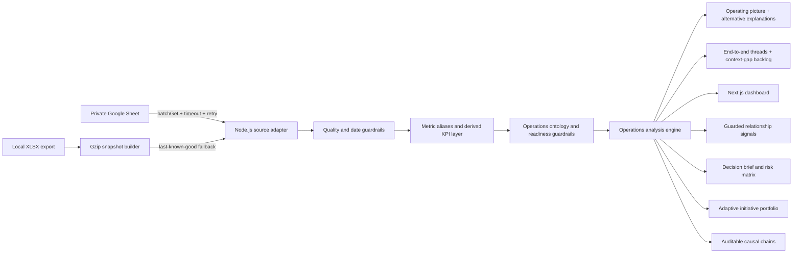

# NEXUS — Excellence Analysis System

NEXUS is a connected operations-intelligence dashboard for FIT quick-commerce warehouses. The first release covers PGS, SRG, BIT, and STR with Daily, Weekly, and Monthly analysis sourced from the FIT Daily Ops Visibility Sheet.

## What the dashboard does

- Connects Personalia → Inbound → Inventory → Outbound → Fleet instead of scoring functions in isolation.
- Compares forecast, actual workload, productivity, SLA, mandays, capacity, cancellation, DCC, troubleshoot, and fulfillment with explicit guardrails.
- Generates recurring 8-week pain points and at least two evidence-linked project recommendations for each warehouse.
- Builds auditable causal chains that separate measured facts, statistically supported signals, directional hypotheses, counter-evidence, and evidence still missing.
- Bundles the 233-entry operations glossary (function, role, BSC/Non-BSC, definition, explanation, and notes) into the metric registry, including definitions whose source values are not active yet.
- Resolves blank descriptions conservatively as `documented`, `inferred`, or `unresolved`; every inference exposes its basis, confidence, and the context still required, while unresolved metrics are blocked from decisions.
- Produces a current operating picture such as demand suppression, surge undercoverage, capacity constraint, inventory drag, volume dilution, or process loss—together with observed facts, plausible mechanisms, alternative explanations, and a sequenced action path.
- Maps five end-to-end operating threads and turns broken stages into a prioritized decision-coverage backlog instead of interpreting blank data as healthy performance.
- Selects adaptive initiative variants from the current warehouse state; title, trigger, why-now, intervention, and stop-loss change when the operating pattern changes.
- Treats every initiative as a decision experiment with a portfolio role, explicit question, counterfactual, and leading indicators so the playbook can change when evidence changes.
- Provides Daily, Weekly, Monthly, or custom date-range pivots with an equal-length previous comparison.
- Benchmarks PGS, SRG, BIT, and STR on a common period and cut-off.
- Includes a transparent scenario lab for volume, attendance, cancel, and process-efficiency changes, guarded by demand fill before cancellation.
- Separates validated labor saving, false economy, under-coverage, and process loss using a non-monetary cost-to-serve proxy: mandays per 1,000 served units.
- Exposes six decision workspaces: Executive Cockpit, Demand & Flow, Relationship Lab, Scenario Studio, Initiative Portfolio, and Metric Registry.
- Adds an 8-week cross-functional risk heatmap, 28-day volume truth, fulfillment loss tree, labor-economics view, zonal capacity history, and priority-versus-effort portfolio.
- Quantifies 84-day Pearson associations with sample size, lag, p-value, multiplicity correction, and hypothesis alignment; these signals are explicitly non-causal.
- Excludes spreadsheet formula errors, treats future dates as plan rather than actual performance, and drops no-operations days instead of scoring them as zero.

## Data architecture



The software stack is free and open-source. Google Sheets API access uses a standard Google service account and its normal free quota; no paid analytics, database, or AI service is required.

## Local development

```powershell
pnpm install
Copy-Item .env.example .env.local
npm run dev
```

For a local workbook, set:

```dotenv
FIT_WORKBOOK_PATH=C:\secure\FIT Daily Ops Visibility Report 2026.xlsx
DATA_CACHE_SECONDS=3600
```

Build the fast snapshot manually when needed:

```powershell
$env:FIT_WORKBOOK_PATH='C:\secure\FIT Daily Ops Visibility Report 2026.xlsx'
npm run snapshot:build
```

The app also builds `.cache/operational-dataset.json.gz` automatically when the workbook is newer than the snapshot.

## Realtime Google Sheets setup

1. Create a Google Cloud service account.
2. Enable Google Sheets API in that project.
3. Share the source Sheet as Viewer to the service-account email.
4. Set `GOOGLE_SERVICE_ACCOUNT_EMAIL` and `GOOGLE_PRIVATE_KEY` from `.env.example`.
5. Do not set `FIT_WORKBOOK_PATH` in production.

The source adapter uses one `spreadsheets.values.batchGet` request for the four priority warehouse tabs plus `Highlight`, maps returned ranges back to their tab names, caches the normalized dataset for 30 seconds by default, and deduplicates concurrent loads. Every successful read records range count, cell count, and a deterministic source revision so operators can distinguish a real data change from a repeated refresh. Transient HTTP 408/429/5xx failures are retried with bounded backoff and a 12-second timeout. If the live source still fails, NEXUS serves the last successful gzip snapshot and marks the UI as `fallback` or `stale` instead of silently presenting it as live.

The dashboard refreshes every 30 seconds only while the tab is visible and online. Manual sync bypasses the memory cache. Request cancellation and sequence checks prevent a slower, older response from overwriting a newer filter result. API responses expose `X-Data-State`, `X-Data-Provider`, `X-Data-As-Of`, and `X-Data-Revision` for monitoring and incident checks.

## Calculation boundaries

- Productivity uses actual goods, not forecast volume.
- Forecast accuracy compares demand before cancellation against the matching weekly forecast. An execution decision to cancel demand cannot rewrite planning quality.
- **Fulfillment is reported twice, on purpose.** `Warehouse FR` divides shipped units by demand *after* cancellation, so cancelling work raises it. `Demand fill rate` divides by demand *before* cancellation and cannot be improved by dropping orders. Read the gap between them as the share of demand that was refused rather than served. The 97% target is derived from the guardrails already in use — FR 99% × (100% − cancel target 2%).
- Mandays saving is only interpreted as healthy when productivity, SLA, **and cancel rate** are all within guardrail. A warehouse that cancels demand needs fewer mandays and posts higher output per manday at the same time, which is indistinguishable from efficiency unless cancellation is checked first.
- Cost-to-serve is an operational labor-intensity proxy (`actual picker mandays ÷ RTS × 1,000`), not currency. No wage or financial cost is fabricated when the source does not contain it.
- Cancel rate compares request before cancel with request after cancel.
- Capacity uses actual against maximum; Ambient, Chiller, and Frozen use the latest available zone value in the active window. Zero readings are dropped (a snapshot that did not run is not an empty warehouse) and two zones reporting an identical actual are flagged rather than drawn as fact.
- `Utilisasi puncak alur` is the highest of inbound, inventory, and outbound utilization. It is a flow measure, not storage occupancy — the zone panel is the occupancy view.
- DCC is connected to putaway, replenish, troubleshoot, SLOC, and picker pressure.
- Relabel forecast pieces and troubleshooter mandays are not available in the source; the dashboard discloses those limits and does not manufacture causal claims.
- `schedule_accuracy` remains visible for inspection but does not trigger pain points or initiatives because its source definition is not yet confirmed.
- Metric readiness has four explicit states: `decision_ready`, `diagnostic_only`, `observational`, and `unconfirmed`. Unconfirmed definitions remain visible in the registry but are blocked from scoring, risk, relationships, and recommendations.
- Definition evidence is separate from metric readiness. A recognizable naming pattern can support an `inferred` working definition without making the metric decision-ready; `unresolved` means the formula/grain/cut-off is too ambiguous to infer responsibly.
- MP Recommendation, division attendance/churn, OTIF, non-picker mandays, and other not-yet-approved fields are not silently promoted into canonical KPI logic. Their source rows remain inspectable until a definition and decision contract are agreed.

## Measurement integrity rules

These exist because each one was a way the earlier dashboard could mislead a reader.

- **One definition of health.** The cockpit gauge and the benchmark table call the same function over the same KPI basket on the same cut-off date. They cannot diverge.
- **A breach cannot be averaged away.** Any KPI outside its guardrail blocks the `controlled` status, however healthy the aggregate looks.
- **What is displayed is what is scored.** Every KPI on a card is in the health basket; none sits outside it as decoration.
- **Missing data is disclosed, never silently rewarded.** Health averages only the pillars that have data, so a warehouse tracking fewer metrics is marked as not comparable and its pillar count is shown next to its rank.
- **Not tracked ≠ stopped reporting.** A metric with history but no data in the active window raises a warning; a metric that was never tracked does not.
- **Correlation confidence follows the p-value**, not the sample size, with a Bonferroni threshold across the whole hypothesis set. Pairs that share an input — picker productivity is volume ÷ mandays, so it shares a term with mandays variance — are labelled as confounded and ranked last.
- **Scores decay, they do not flatline.** A shortfall halves the score every fixed number of points rather than clipping to zero, so metrics far below target still rank against each other. The previous linear penalty scored 0 on 100% of one warehouse's schedule-accuracy observations, freezing its risk row into a flat line.
- **Evidence outranks defaults.** Initiatives linked to a recurring pain point fill the list first; baseline fallbacks only take leftover slots.
- **The engine reconciles against the source.** Where the spreadsheet computes a metric itself, the engine's derivation is compared to it and a divergence above 2 pp raises a warning.

## Quality gate

```powershell
npm run quality
```

This runs TypeScript, ESLint, unit tests, and an optimized Next.js production build.
