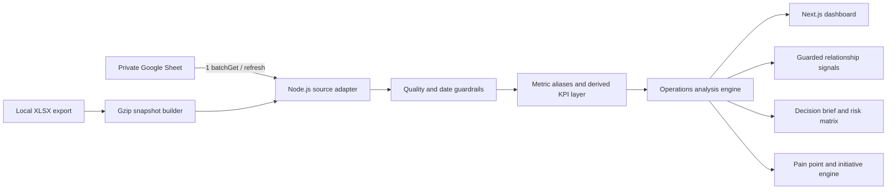

# NEXUS — Excellence Analysis System

NEXUS is a connected operations-intelligence dashboard for FIT quick-commerce warehouses. The first release covers PGS, SRG, BIT, and STR with Daily, Weekly, and Monthly analysis sourced from the FIT Daily Ops Visibility Sheet.

## What the dashboard does

- Connects Personalia → Inbound → Inventory → Outbound → Fleet instead of scoring functions in isolation.
- Compares forecast, actual workload, productivity, SLA, mandays, capacity, cancellation, DCC, troubleshoot, and fulfillment with explicit guardrails.
- Generates recurring 8-week pain points and at least two evidence-linked project recommendations for each warehouse.
- Provides current-vs-previous pivots by warehouse, function, role, period, and actual-data cut-off.
- Benchmarks PGS, SRG, BIT, and STR on a common period and cut-off.
- Includes a transparent scenario lab for volume, attendance, cancel, and process-efficiency changes.
- Exposes six decision workspaces: Executive Cockpit, Demand & Flow, Relationship Lab, Scenario Studio, Initiative Portfolio, and Metric Registry.
- Adds an 8-week cross-functional risk heatmap, 28-day volume truth, fulfillment loss tree, labor-economics view, zonal capacity history, and priority-versus-effort portfolio.
- Quantifies 84-day Pearson associations with sample size, lag, confidence, and hypothesis alignment; these signals are explicitly non-causal.
- Excludes spreadsheet formula errors and treats future dates as plan rather than actual performance.

## Data architecture



The software stack is free and open-source. Google Sheets API access uses a standard Google service account and its normal free quota; no paid analytics, database, or AI service is required.

## Local development

```powershell
pnpm install
Copy-Item .env.example .env.local
npm run dev
```

For a local workbook, set:

```dotenv
FIT_WORKBOOK_PATH=C:\secure\FIT Daily Ops Visibility Report 2026.xlsx
DATA_CACHE_SECONDS=3600
```

Build the fast snapshot manually when needed:

```powershell
$env:FIT_WORKBOOK_PATH='C:\secure\FIT Daily Ops Visibility Report 2026.xlsx'
npm run snapshot:build
```

The app also builds `.cache/operational-dataset.json.gz` automatically when the workbook is newer than the snapshot.

## Realtime Google Sheets setup

1. Create a Google Cloud service account.
2. Enable Google Sheets API in that project.
3. Share the source Sheet as Viewer to the service-account email.
4. Set `GOOGLE_SERVICE_ACCOUNT_EMAIL` and `GOOGLE_PRIVATE_KEY` from `.env.example`.
5. Do not set `FIT_WORKBOOK_PATH` in production.

The source adapter uses one `spreadsheets.values.batchGet` request for the four priority warehouse tabs plus `Highlight`, caches the normalized dataset for 60 seconds by default, deduplicates concurrent loads, and falls back to the last successful gzip snapshot if Google is temporarily unavailable.

## Calculation boundaries

- Productivity uses actual goods, not forecast volume.
- Forecast accuracy compares actual/requested workload against the matching weekly forecast.
- Mandays saving is only interpreted as healthy when productivity and SLA guardrails remain healthy.
- Cancel rate compares request before cancel with request after cancel.
- Capacity uses actual against maximum; Ambient, Chiller, and Frozen use the latest available zone value in the active window.
- DCC is connected to putaway, replenish, troubleshoot, SLOC, and picker pressure.
- Relabel forecast pieces and troubleshooter mandays are not available in the source; the dashboard discloses those limits and does not manufacture causal claims.

## Quality gate

```powershell
npm run quality
```

This runs TypeScript, ESLint, unit tests, and an optimized Next.js production build.
