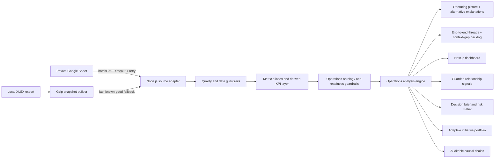

# NEXUS — Excellence Analysis System

NEXUS is a connected operations-intelligence dashboard for FIT quick-commerce warehouses. The first release covers PGS, SRG, BIT, and STR with Daily, Weekly, and Monthly analysis sourced from the FIT Daily Ops Visibility Sheet.

## What the dashboard does

- Connects Personalia → Inbound → Inventory → Outbound → Fleet instead of scoring functions in isolation.
- Compares forecast, actual workload, productivity, SLA, mandays, capacity, cancellation, DCC, troubleshoot, and fulfillment with explicit guardrails.
- Generates recurring 8-week pain points and at least two evidence-linked project recommendations for each warehouse.
- Builds auditable causal chains that separate measured facts, statistically supported signals, directional hypotheses, counter-evidence, and evidence still missing.
- Bundles the 233-entry operations glossary (function, role, BSC/Non-BSC, definition, explanation, and notes) into the metric registry, including definitions whose source values are not active yet.
- Resolves blank descriptions conservatively as `documented`, `inferred`, or `unresolved`; every inference exposes its basis, confidence, and the context still required, while unresolved metrics are blocked from decisions.
- Produces a current operating picture such as demand suppression, surge undercoverage, capacity constraint, inventory drag, volume dilution, or process loss—together with observed facts, plausible mechanisms, alternative explanations, and a sequenced action path.
- Maps five end-to-end operating threads and turns broken stages into a prioritized decision-coverage backlog instead of interpreting blank data as healthy performance.
- Walks the physical flow as fifteen floor stations across six stages — the day's plan and the roster, then the PO desk, GRN lane, QC gate, relabel bench, putaway aisle, zone capacity, cycle count, recovery queue, pickface refill, wave desk, packing bench, loading dock, and the wastage ledger — each with its measured signals, its WMS transactions, the gemba checks a supervisor performs there, and failure modes that only fire when the data satisfies their trigger.
- Separates forecast bias from forecast noise, ordinary variation from special causes, and reliable percentages from small-sample ones, then sizes each action plan in units and mandays computed from the active window.
- Selects adaptive initiative variants from the current warehouse state; title, trigger, why-now, intervention, and stop-loss change when the operating pattern changes.
- Treats every initiative as a decision experiment with a portfolio role, explicit question, counterfactual, and leading indicators so the playbook can change when evidence changes.
- Provides Daily, Weekly, Monthly, or custom date-range pivots with an equal-length previous comparison.
- Benchmarks PGS, SRG, BIT, and STR on a common period and cut-off.
- Includes a transparent scenario lab for volume, attendance, cancel, and process-efficiency changes, guarded by demand fill before cancellation.
- Separates validated labor saving, false economy, under-coverage, and process loss using a non-monetary cost-to-serve proxy: mandays per 1,000 served units.
- Exposes eight decision workspaces, grouped as Lihat (Ringkasan, Lantai, Alur volume, Bukti), Putuskan (Simulasi, Rencana aksi), and Rujukan (Pengetahuan, Data & definisi).
- Adds an 8-week cross-functional risk heatmap, 28-day volume truth, fulfillment loss tree, labor-economics view, zonal capacity history, and priority-versus-effort portfolio.
- Quantifies 84-day Pearson associations with sample size, lag, p-value, multiplicity correction, and hypothesis alignment; these signals are explicitly non-causal.
- Excludes spreadsheet formula errors, treats future dates as plan rather than actual performance, and drops no-operations days instead of scoring them as zero.

## Data architecture



The software stack is free and open-source. Google Sheets API access uses a standard Google service account and its normal free quota; no paid analytics, database, or AI service is required.

## Local development

```powershell
pnpm install
Copy-Item .env.example .env.local
npm run dev
```

For a local workbook, set:

```dotenv
FIT_WORKBOOK_PATH=C:\secure\FIT Daily Ops Visibility Report 2026.xlsx
DATA_CACHE_SECONDS=3600
```

Build the fast snapshot manually when needed:

```powershell
$env:FIT_WORKBOOK_PATH='C:\secure\FIT Daily Ops Visibility Report 2026.xlsx'
npm run snapshot:build
```

The app also builds `.cache/operational-dataset.json.gz` automatically when the workbook is newer than the snapshot.

## Realtime Google Sheets setup

1. Create a Google Cloud service account.
2. Enable Google Sheets API in that project.
3. Share the source Sheet as Viewer to the service-account email.
4. Set `GOOGLE_SERVICE_ACCOUNT_EMAIL` and `GOOGLE_PRIVATE_KEY` from `.env.example`.
5. Do not set `FIT_WORKBOOK_PATH` in production.

The source adapter uses one `spreadsheets.values.batchGet` request for the four priority warehouse tabs plus `Highlight`, maps returned ranges back to their tab names, caches the normalized dataset for 30 seconds by default, and deduplicates concurrent loads. Every successful read records range count, cell count, and a deterministic source revision so operators can distinguish a real data change from a repeated refresh. Transient HTTP 408/429/5xx failures are retried with bounded backoff and a 12-second timeout. If the live source still fails, NEXUS serves the last successful gzip snapshot and marks the UI as `fallback` or `stale` instead of silently presenting it as live.

The dashboard refreshes every 30 seconds only while the tab is visible and online. Manual sync bypasses the memory cache. Request cancellation and sequence checks prevent a slower, older response from overwriting a newer filter result. API responses expose `X-Data-State`, `X-Data-Provider`, `X-Data-As-Of`, and `X-Data-Revision` for monitoring and incident checks.

## Calculation boundaries

- Productivity uses actual goods, not forecast volume. Period productivity is weighted by actual mandays (`Σ(actual productivity × actual MD) ÷ Σ(target productivity × actual MD)`), so a quiet day cannot influence a weekly result as much as a busy day.
- Forecast accuracy compares demand before cancellation against the matching weekly forecast. An execution decision to cancel demand cannot rewrite planning quality.
- **Fulfillment is reported twice, on purpose.** `Warehouse FR` is calculated from period totals (`ΣRTS ÷ Σrequest after cancel`), never from the latest date or an unweighted average of daily percentages. `Demand fill rate` divides the same RTS total by demand *before* cancellation and cannot be improved by dropping orders. Read the gap between them as the share of demand that was refused rather than served. The 97% target is derived from the guardrails already in use — FR 99% × (100% − cancel target 2%).
- Mandays saving is only interpreted as healthy when productivity, SLA, **and cancel rate** are all within guardrail. A warehouse that cancels demand needs fewer mandays and posts higher output per manday at the same time, which is indistinguishable from efficiency unless cancellation is checked first.
- Cost-to-serve is an operational labor-intensity proxy (`actual picker mandays ÷ RTS × 1,000`), not currency. No wage or financial cost is fabricated when the source does not contain it.
- Cancel rate compares request before cancel with request after cancel.
- Capacity uses actual against maximum; Ambient, Chiller, and Frozen use the latest available zone value in the active window. Zero readings are dropped (a snapshot that did not run is not an empty warehouse) and two zones reporting an identical actual are flagged rather than drawn as fact.
- `Utilisasi puncak alur` is the highest of inbound, inventory, and outbound utilization. It is a flow measure, not storage occupancy — the zone panel is the occupancy view.
- DCC is connected to putaway, replenish, troubleshoot, SLOC, and picker pressure.
- Relabel forecast pieces and troubleshooter mandays are not available in the source; the dashboard discloses those limits and does not manufacture causal claims.
- `schedule_accuracy` remains visible for inspection but does not trigger pain points or initiatives because its source definition is not yet confirmed.
- Metric readiness has four explicit states: `decision_ready`, `diagnostic_only`, `observational`, and `unconfirmed`. Unconfirmed definitions remain visible in the registry but are blocked from scoring, risk, relationships, and recommendations.
- Definition evidence is separate from metric readiness. A recognizable naming pattern can support an `inferred` working definition without making the metric decision-ready; `unresolved` means the formula/grain/cut-off is too ambiguous to infer responsibly.
- MP Recommendation, division attendance/churn, OTIF, non-picker mandays, and other not-yet-approved fields are not silently promoted into canonical KPI logic. Their source rows remain inspectable until a definition and decision contract are agreed.

## The floor layer

The KPI layer answers whether the warehouse is healthy. The floor layer answers which bench, lane, or desk produced that number, and what a supervisor would look at while standing in front of it. It lives in `lib/analysis/floor-operations.ts` and keeps three kinds of content strictly apart:

- **Measured signals** — source columns read through the shared alias registry and graded with the same decay curve as the KPI engine. Where a station borrows a metric the engine already derives, it quotes the engine's own reading, so a station and the KPI card above it can never show two different numbers for the same thing.
- **Protocol** — the WMS transactions the station executes and the physical checks a supervisor performs there. Standing operating knowledge; nothing in it is presented as a reading from the sheet.
- **Failure modes** — each carries a numeric trigger and is either active on the current window's data or dormant, with the dormant ones and their triggers still listed. A mode never fires on narrative alone.

Station thresholds state their own basis. `source_target` comes from a target column in the sheet, `guardrail` reuses a limit already agreed elsewhere in the product, and `working_threshold` was set by this engine because the source has none — those are meant to be argued with, not obeyed. Signals with no defensible threshold are shown as context and are not graded at all.

Station scores never feed the warehouse health score. `healthFrom()` remains the single definition of health, over the unchanged `KPI_KEYS` basket.

Newly mapped source columns (PO adjustment, vendor OTIF, checker on-time/late, relabel and replenishment mandays, putaway capacity and utilisation, LDP/LBH value and share, troubleshoot contribution to SO FR, packer and loader productivity, SEUIC device adoption, pick-to-lost/bad, koli hilang di staging, hub-side fulfillment, depart and arrival punctuality, per-division attendance) feed this layer only. Promoting any of them into the health basket would change what every historical score meant, which is a decision for the metric owner.

Two mapping gaps were closed rather than left as blanks: STR labels checker output `Checker Productivity Collective` where the others use the longer spelling, and BIT, SRG, and STR carry putaway forecast as bare `Forecast MPP` / `Forecast Weekly`. In both cases the spellings are mutually exclusive per warehouse, so they are one metric under two names. `Putaway Productivity` and `Putaway Actual Productivity Collective` are **not** merged — PGS and SRG report both with different values, so they are two definitions and the station shows them separately.

## Operational statistics

`lib/analysis/operations-math.ts` answers four questions a single percentage cannot. Every function is computable from columns the sheet already carries; there is no lead time, queue depth, or WIP in this data, so there is no Little's Law here either.

| Question | Method | Why a percentage is not enough |
| --- | --- | --- |
| Is the plan wrong in one direction, or just noisy? | Bias (MPE) vs dispersion (MAPE − \|bias\|) | 80% accuracy that is always 20% under is a planning fix. 80% accuracy swinging ±40% around a correct average is a capacity fix. The two demand opposite actions. |
| Was yesterday an event, or is this the process? | Individuals control chart, σ from the mean moving range ÷ 1.128, Nelson rules 1 and 2 | Chasing a bad day inside the limits changes nothing. A shift of eight points on one side never leaves the limits and would otherwise go unseen. |
| Can this percentage settle an argument? | Wilson 95% interval | Vendor OTIF of 86% is 90 on-time out of 103 — roughly ±7 points. The gap to a 95% target is real; a 3-point week-on-week move is not. |
| How many people did the workload need? | Volume ÷ the source's own productivity target | Not a new standard: it is the target column read backwards, so it can be stated without inventing anything. |

The yield chain adds cumulative yield and each step's share of total loss, so the biggest leak is identified by size rather than by whichever step is discussed first.

Sigma comes from the moving range rather than the standard deviation on purpose: a genuine process shift inflates sd, widening the limits enough to hide itself.

## Incentives: BSC and Non-BSC

The glossary's `remarks` column marks 32 metrics as **BSC** — the set that carries an incentive bonus — and the rest as Non-BSC. The engine reads that classification rather than inferring it, badges it in the registry, and uses it to detect a structural problem the KPI cards cannot see.

The bonus set rewards productivity, SLA, dispatch punctuality, and every loss *ratio*. It does not include the size of the demand those ratios are measured over. Cancelling a Supply Order therefore shrinks the denominator of several bonus metrics at once — productivity rises because hard orders disappear, pick-to-lost and staging-loss ratios improve because less is handled, dispatch punctuality improves because less is shipped — while the only figure that worsens, the share of demand actually served, pays nothing.

This is not an accusation of gaming. It is a predictable consequence of the scheme, and naming it is cheaper than discovering it through behaviour. Each conflict pairs the bonus metric with the metric that pays for it, states the mechanism, and is marked `active` only when the window's own numbers show the pattern.

## Scenario model

The simulation is arithmetic on the warehouse's own identities, not fitted coefficients:

```
demand'      = demand × (1 + demandChange)
afterCancel' = demand' × (1 − cancelRate')
throughput_r = mandays_r × demonstratedRate_r × (1 + processGain)
ceiling      = min(afterCancel', min_r throughput_r, physical capacity)
served       = ceiling × executionYield
```

Capacity is projected from the rate each bench **actually achieved**, not from its target. The first draft used the target and immediately produced a false answer: PGS packers beat their target by 5%, so a target-rate model declared packing the constraint on a day it was comfortably keeping up. Attainment is still scored against the target, so beating it reads as a win rather than a lowered bar.

`executionYield` is the single calibration — observed served divided by the model's own ceiling on the active window. It absorbs every loss the model does not name and is held constant, which is stated in the assumptions panel rather than hidden. It is capped at 1: a yield above 100% means the ceiling is wrong, not that the warehouse is superhuman.

The chain runs at the speed of its slowest station, so the model names the binding constraint — demand, a specific role, or physical capacity. This matters more than any percentage it prints. On PGS the model shows only ~199 units of spare capacity at the tightest bench, which means the 18,765 units that "stopping cancellation" would return to the order book cannot currently be served: they would move from cancelled to unserved. The cancellation initiative now carries both figures, because publishing the first without the second is how a warehouse gets told to stop cancelling and simply fails the orders instead.

## Knowledge base

`lib/analysis/knowledge-base.ts` holds the operating doctrine as three kinds of article, kept apart because they carry different authority:

- **Proses** — how the work is supposed to run, including steps the sheet does not measure. Dock scheduling, cold chain, FEFO, cycle count design, slotting, min–max, wave design, staging, hub handover, shift handover, roster, the OJT learning curve, device and master-data discipline, and the housekeeping that shows up in the numbers two weeks later.
- **Rumus** — every number this product computes, written out with its basis. If a formula is not here, the product should not be showing the number.
- **Aturan** — what may and may not be concluded from a reading.

## Measurement integrity rules

These exist because each one was a way the earlier dashboard could mislead a reader.

- **One definition of health.** The cockpit gauge and the benchmark table call the same function over the same KPI basket on the same cut-off date. They cannot diverge.
- **A breach cannot be averaged away.** Any KPI outside its guardrail blocks the `controlled` status, however healthy the aggregate looks.
- **What is displayed is what is scored.** Every KPI on a card is in the health basket; none sits outside it as decoration.
- **Missing data is disclosed, never silently rewarded.** Health averages only the pillars that have data, so a warehouse tracking fewer metrics is marked as not comparable and its pillar count is shown next to its rank.
- **Not tracked ≠ stopped reporting.** A metric with history but no data in the active window raises a warning; a metric that was never tracked does not.
- **Correlation confidence follows the p-value**, not the sample size, with a Bonferroni threshold across the whole hypothesis set. Pairs that share an input — picker productivity is volume ÷ mandays, so it shares a term with mandays variance — are labelled as confounded and ranked last.
- **Scores decay, they do not flatline.** A shortfall halves the score every fixed number of points rather than clipping to zero, so metrics far below target still rank against each other. The previous linear penalty scored 0 on 100% of one warehouse's schedule-accuracy observations, freezing its risk row into a flat line.
- **Evidence outranks defaults.** Initiatives linked to a recurring pain point fill the list first; baseline fallbacks only take leftover slots.
- **The engine reconciles against the source.** Where the spreadsheet computes a metric itself, the engine's derivation is compared to it. Forecast accuracy warns above 2 pp; high-precision warehouse fulfillment warns above 0.05 pp.

## Quality gate

```powershell
npm run quality
```

This runs TypeScript, ESLint, unit tests, and an optimized Next.js production build.
